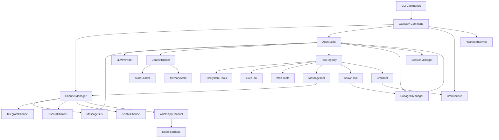

# Nanobot 模块关系文档

## 模块依赖关系详解

### 1. 核心循环依赖图



### 2. 数据流向

#### 2.1 入站消息处理流

```
┌──────────┐    ┌─────────────┐    ┌─────────────┐    ┌─────────────┐
│  User    │───▶│   Channel   │───▶│ MessageBus  │───▶│  AgentLoop  │
│ Message  │    │  (Gateway)  │    │  (inbound)  │    │  (process)  │
└──────────┘    └─────────────┘    └─────────────┘    └──────┬──────┘
                                                             │
                                    ┌────────────────────────┼────────────────────────┐
                                    │                        │                        │
                                    ▼                        ▼                        ▼
                              ┌──────────┐           ┌─────────────┐          ┌──────────┐
                              │ Session  │           │   Context   │          │   LLM    │
                              │ Manager  │           │   Builder   │          │ Provider │
                              └──────────┘           └─────────────┘          └────┬─────┘
                                                                                   │
                                                                                   ▼
                                                                           ┌─────────────┐
                                                                           │ Tool Calls  │
                                                                           │  (if any)   │
                                                                           └──────┬──────┘
                                                                                  │
                                                                                  ▼
                                                                           ┌─────────────┐
                                                                           │  Tool       │
                                                                           │  Registry   │
                                                                           └─────────────┘
```

#### 2.2 出站消息流

```
┌──────────┐    ┌─────────────┐    ┌─────────────┐    ┌─────────────┐
│ Agent    │───▶│ MessageBus  │───▶│   Channel   │───▶│    User     │
│ Response │    │ (outbound)  │    │   Manager   │    │   Chat      │
└──────────┘    └─────────────┘    └─────────────┘    └─────────────┘
```

#### 2.3 子代理执行流

```
┌──────────┐    ┌─────────────┐    ┌─────────────┐    ┌─────────────┐
│  Spawn   │───▶│ Subagent    │───▶│  Background │───▶│   Result    │
│  Tool    │    │  Manager    │    │    Task     │    │  (System)   │
└──────────┘    └─────────────┘    └─────────────┘    └──────┬──────┘
                                                             │
                                                             ▼
                                                      ┌─────────────┐
                                                      │ MessageBus  │
                                                      │  (inbound)  │
                                                      └─────────────┘
```

### 3. 模块交互矩阵

| 模块 | AgentLoop | ChannelMgr | ToolRegistry | SessionMgr | SubagentMgr | CronService | MessageBus |
|------|:---------:|:----------:|:------------:|:----------:|:-----------:|:-----------:|:----------:|
| **AgentLoop** | - | 读取 | 调用 | 管理 | 调用 | - | 发布/消费 |
| **ChannelMgr** | - | - | - | - | - | - | 发布/消费 |
| **ToolRegistry** | 被调用 | - | - | - | - | - | - |
| **SessionMgr** | 被调用 | - | - | - | - | - | - |
| **SubagentMgr** | 间接 | - | 内部 | 内部 | - | - | 发布 |
| **CronService** | - | - | - | - | - | - | 发布 |
| **MessageBus** | 被使用 | 被使用 | - | - | - | - | - |

### 4. 工具调用链

#### 4.1 文件系统工具链

```
AgentLoop
    │
    ├──▶ ToolRegistry.execute("read_file")
    │           │
    │           └──▶ ReadFileTool.execute(path)
    │                   │
    │                   └──▶ 文件系统读取
    │                           │
    │                           └──▶ 返回内容
    │
    ├──▶ ToolRegistry.execute("write_file")
    │           │
    │           └──▶ WriteFileTool.execute(path, content)
    │                   │
    │                   ├──▶ 创建父目录
    │                   └──▶ 写入文件
    │
    └──▶ ToolRegistry.execute("edit_file")
                │
                └──▶ EditFileTool.execute(path, old, new)
                        │
                        ├──▶ 读取原文件
                        ├──▶ 精确匹配 old
                        └──▶ 替换为 new
```

#### 4.2 Web 工具链

```
AgentLoop
    │
    ├──▶ ToolRegistry.execute("web_search")
    │           │
    │           └──▶ WebSearchTool.execute(query)
    │                   │
    │                   ├──▶ Brave Search API
    │                   └──▶ 返回搜索结果
    │
    └──▶ ToolRegistry.execute("web_fetch")
                │
                └──▶ WebFetchTool.execute(url)
                        │
                        ├──▶ HTTP GET
                        ├──▶ Readability 解析
                        └──▶ 返回 Markdown
```

#### 4.3 消息工具链

```
AgentLoop
    │
    └──▶ ToolRegistry.execute("message")
                │
                └──▶ MessageTool.execute(content, channel, chat_id)
                        │
                        ├──▶ 设置上下文
                        └──▶ MessageBus.publish_outbound()
                                    │
                                    └──▶ ChannelManager._dispatch_outbound()
                                                │
                                                └──▶ Channel.send()
```

### 5. 配置依赖关系

```
Config (Root)
│
├──▶ AgentsConfig
│       │
│       └──▶ AgentDefaults
│               ├──▶ workspace: Path
│               ├──▶ model: str
│               ├──▶ max_tokens: int
│               ├──▶ temperature: float
│               └──▶ max_tool_iterations: int
│
├──▶ ChannelsConfig
│       │
│       ├──▶ WhatsAppConfig (enabled, allowed_users)
│       ├──▶ TelegramConfig (enabled, token, allowed_users)
│       ├──▶ DiscordConfig (enabled, token, allowed_users)
│       └──▶ FeishuConfig (enabled, app_id, app_secret, allowed_users)
│
├──▶ ProvidersConfig
│       │
│       └──▶ [ProviderConfig]
│               ├──▶ api_key: str
│               ├──▶ api_base: str | None
│               └──▶ extra_headers: dict
│
├──▶ GatewayConfig
│       ├──▶ enabled: bool
│       └──▶ port: int
│
└──▶ ToolsConfig
        ├──▶ web: WebToolsConfig (brave_api_key)
        ├──▶ exec: ExecToolConfig (timeout, allow_all, allowed_patterns, denied_patterns)
        └──▶ restrict_to_workspace: bool
```

### 6. 启动时序图

```
Gateway Command
      │
      ├──▶ ChannelManager
      │       │
      │       ├──▶ _init_channels()
      │       │       ├──▶ TelegramChannel (if enabled)
      │       │       ├──▶ DiscordChannel (if enabled)
      │       │       ├──▶ FeishuChannel (if enabled)
      │       │       └──▶ WhatsAppChannel (if enabled)
      │       │
      │       └──▶ _dispatch_outbound() [后台任务]
      │
      ├──▶ AgentLoop
      │       │
      │       ├──▶ 初始化 MessageBus
      │       ├──▶ 初始化 LLMProvider
      │       ├──▶ 初始化 ContextBuilder
      │       ├──▶ 初始化 ToolRegistry
      │       │       ├──▶ 注册文件系统工具
      │       │       ├──▶ 注册 Shell 工具
      │       │       ├──▶ 注册 Web 工具
      │       │       ├──▶ 注册 Message 工具
      │       │       ├──▶ 注册 Spawn 工具
      │       │       └──▶ 注册 Cron 工具
      │       ├──▶ 初始化 SubagentManager
      │       └──▶ 初始化 SessionManager
      │
      ├──▶ CronService (if enabled)
      │       │
      │       └──▶ start() [加载任务并开始调度]
      │
      └──▶ HeartbeatService (if enabled)
              │
              └──▶ start() [加载 HEARTBEAT.md 并开始检查]
```

### 7. 关键接口定义

#### 7.1 Channel 接口

```python
class BaseChannel(ABC):
    @abstractmethod
    async def start(self) -> None: ...
    
    @abstractmethod
    async def stop(self) -> None: ...
    
    @abstractmethod
    async def send(self, msg: OutboundMessage) -> None: ...
    
    def is_allowed(self, sender_id: str) -> bool: ...
```

#### 7.2 Tool 接口

```python
class Tool(ABC):
    @property
    @abstractmethod
    def name(self) -> str: ...
    
    @property
    @abstractmethod
    def description(self) -> str: ...
    
    @property
    @abstractmethod
    def parameters(self) -> dict[str, Any]: ...
    
    @abstractmethod
    async def execute(self, **kwargs: Any) -> str: ...
```

#### 7.3 LLM Provider 接口

```python
class LLMProvider(ABC):
    @abstractmethod
    async def chat(
        self,
        messages: list[dict[str, Any]],
        model: str | None = None,
        tools: list[dict[str, Any]] | None = None,
    ) -> LLMResponse: ...
    
    @abstractmethod
    def get_default_model(self) -> str: ...
```

### 8. 扩展点

#### 8.1 添加新通道

1. 继承 `BaseChannel`
2. 实现 `start()`, `stop()`, `send()` 方法
3. 在 `ChannelManager._init_channels()` 中注册

#### 8.2 添加新工具

1. 继承 `Tool`
2. 实现 `name`, `description`, `parameters` 属性和 `execute()` 方法
3. 在 `AgentLoop.__init__()` 中注册到 `ToolRegistry`

#### 8.3 添加新 LLM Provider

1. 继承 `LLMProvider`
2. 实现 `chat()` 和 `get_default_model()` 方法
3. 在配置中添加 provider 配置

### 9. 数据持久化

| 数据类型 | 存储位置 | 格式 |
|----------|----------|------|
| 会话历史 | `workspace/sessions/{key}.jsonl` | JSONL |
| 长期记忆 | `workspace/memory/MEMORY.md` | Markdown |
| 每日笔记 | `workspace/memory/YYYY-MM-DD.md` | Markdown |
| 配置 | `workspace/config.yaml` | YAML |
| 技能 | `nanobot/skills/` 或 `workspace/skills/` | Markdown |
| Cron 任务 | `workspace/cron_jobs/` | JSON |
| WhatsApp 认证 | `~/.nanobot/whatsapp-auth/` | Baileys 格式 |
